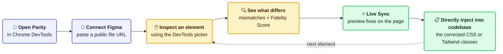

<i>"Hey um...this looks nothing like the design" </i>

# 🎨 Parity 🎨

Parity is a Chrome DevTools extension that helps frontend developers bridge the gap between design and implementation. Instead of manually comparing a webpage against a Figma design, developers can inspect any element and instantly identify visual mismatches such as incorrect spacing, typography, colors, sizing, and border radius.

Parity highlights these inconsistencies directly inside Chrome DevTools and allows developers to preview fixes in real time through temporary CSS injection before generating the corrected CSS or Tailwind classes.

Rather than acting as another visual testing platform, Parity transforms UI implementation into an interactive debugging experience, helping teams maintain design fidelity while reducing repetitive designer-developer feedback cycles.

---

## MVP ✅

- **Chrome DevTools Extension** → Dedicated Parity panel integrated with Chrome's element inspector
- **Figma Integration** → Connect a public Figma file through the Figma API and select a frame/screen to compare
- **Element Inspection & Comparison** → Inspect webpage elements and compare computed CSS against the corresponding Figma design
- **Mismatch Detection** → Detect differences in typography, spacing, colors, sizing, border radius, and other design properties
- **Design Fidelity Score** → Display a Parity/design fidelity score for selected elements
- **Detailed Comparison Results** → Show the expected Figma value alongside the current implementation value
- **Live Design Sync** → Preview fixes instantly through temporary CSS injection without modifying source code
- **Individual / Bulk Fixes** → Apply or remove individual fixes, or apply all detected fixes
- **Code Generation** → Generate corrected CSS and equivalent Tailwind utility classes when supported
- **Copy to Source** → Copy generated code into the project's source files

### User Flow 🗺️

---

## Stretch Goals 💪

- Automatic Figma component detection and matching
- Responsive design validation for desktop, tablet, and mobile
- VS Code integration to jump directly to the source component
- One-click source code fixes
- Pull Request generation
- Design Token detection and suggestions
- Team-wide Design Fidelity Score dashboard
- Compare entire pages instead of individual components

---

## Tech Stack & Resources 🖥️

**React + TypeScript (Vite) • Tailwind CSS • Chrome Extension MV3 • Node.js / Express • PostgreSQL (Supabase) • Figma REST API**

🎨 <b>Frontend</b>

- [React Docs](https://react.dev/)
- [TypeScript Docs](https://www.typescriptlang.org/docs/)
- [Vite Docs](https://vite.dev/guide/)
- [Tailwind CSS Docs](https://tailwindcss.com/docs)
- [VIDEO: How To Setup Your First React + TypeScript Project With Vite](https://www.youtube.com/watch?v=RbZyQWOEmD0)
- [VIDEO: React Beginner Course 2025 (Vite, Tailwind CSS, TypeScript)](https://www.youtube.com/watch?v=siTUv1L9ymM)
- [VIDEO: Learn TypeScript with React - Full Beginner Tutorial](https://www.youtube.com/watch?v=DxqiBrERv6o)
- [VIDEO: TypeScript in React - COMPLETE Tutorial (Crash Course)](https://www.youtube.com/watch?v=TPACABQTHvM)
- [VIDEO: Tailwind in 100 Seconds](https://www.youtube.com/watch?v=mr15Xzb1Ook&t=2s)
- [VIDEO: Tailwind CSS v4 Full Course | Master Tailwind in One Hour](https://www.youtube.com/watch?v=6biMWgD6_JY&t=159s)

⚙️ <b>Backend</b>

- [Node.js Docs](https://nodejs.org/docs/latest/api/)
- [Express Docs](https://expressjs.com/)
- [VIDEO: What is Node.js and how it works (explained in 2 minutes)](https://www.youtube.com/watch?v=q-xS25lsN3I)
- [VIDEO: Node.js Ultimate Beginner's Guide in 7 Easy Steps](https://www.youtube.com/watch?v=ENrzD9HAZK4)
- [VIDEO: Learn Express JS In 35 Minutes](https://www.youtube.com/watch?v=SccSCuHhOw0)

🧩 <b>Chrome Extension</b>

- [Chrome Extensions: Manifest V3 Overview](https://developer.chrome.com/docs/extensions/develop/migrate/what-is-mv3)
- [Chrome Extensions API Reference](https://developer.chrome.com/docs/extensions/reference/api)
- [Chrome DevTools Extension API](https://developer.chrome.com/docs/extensions/how-to/devtools/extend-devtools)

🔗 <b>APIs</b>

- [Figma REST API Docs](https://www.figma.com/developers/api)
- [MDN: `getComputedStyle()`](https://developer.mozilla.org/en-US/docs/Web/API/Window/getComputedStyle)
- [VIDEO: What is an API (in 5 minutes)](https://www.youtube.com/watch?v=ByGJQzlzxQg)
- [VIDEO: APIs for Beginners - How to use an API (Full Course / Tutorial)](https://www.youtube.com/watch?v=WXsD0ZgxjRw)

🗄️ <b>Database</b>

Used primarily to avoid repeatedly fetching the same Figma file. Stores connected project information and only the properties needed for comparison.

- [Supabase Docs](https://supabase.com/docs)
- [PostgreSQL Docs](https://www.postgresql.org/docs/)
- [VIDEO: Learn PostgreSQL Tutorial - Full Course for Beginners](https://www.youtube.com/watch?v=qw--VYLpxG4)

---

## Roadmap 📅

| Week | Frontend | Backend |
|---|---|---|
| **1** | React + TypeScript + Tailwind setup; initialize Chrome Extension (Manifest V3); create popup, background script, and DevTools panel structure | Node.js setup; PostgreSQL/Supabase setup; Figma API authentication; GitHub repository, environments, and architecture |
| **2** | Build Parity panel; create Connect Figma interface; display connection status; show available Figma frames; create frame selection interface | Integrate Figma API; fetch file metadata, frames, colors, and typography; store connected project information |
| **3–4** | Integrate Chrome element inspector; display selected element information; build comparison results UI; organize properties by category; highlight mismatches | Read computed CSS with `getComputedStyle()`; compare webpage styles with Figma properties; calculate design differences |
| **5–6** | Implement Live Design Sync; Apply Design / Apply All controls; toggle fixes; update Design Fidelity score in real time; build CSS/Tailwind code generation interface | Implement temporary CSS injection; generate temporary CSS rules; update comparison results; generate standard CSS and supported Tailwind classes |
| **7–8** | Refine DevTools UX; improve navigation; add loading, empty, and error states; refine comparison sections and mismatch indicators | Optimize comparison performance; cache Figma API responses; improve multi-element performance; handle invalid Figma files and dynamic webpages |
| **9–10** | Prepare demo, presentation slides, and practice script | Final testing and demo support |

### Key Milestones

- [ ] Extension successfully loads in Chrome
- [ ] Successfully connect a Figma file
- [ ] Display available Figma frames
- [ ] Select any webpage element
- [ ] View detected design differences
- [ ] Preview design fixes directly on the webpage
- [ ] Generate corrected CSS and Tailwind classes
- [ ] Update comparison results in real time
- [ ] Complete final demo and presentation

---

## Project Goals 🎯

- Reduce repetitive designer-developer feedback cycles
- Help developers maintain design fidelity during implementation
- Turn visual design comparison into an interactive debugging workflow
- Provide immediate visual feedback before permanent source-code changes
- Make it easier to translate design differences into actionable CSS or Tailwind fixes

---

## GitHub Cheat Sheet 💬

| Command | Description |
|---|---|
| `git status` | Check the current state of your working tree |
| `git branch` | List your local branches |
| `git branch "branch-name"` | Create a new branch |
| `git checkout "branch-name"` | Switch to a branch |
| `git checkout -b "branch-name"` | Create and switch to a new branch |
| `git add .` | Stage all changed files |
| `git commit -m "message"` | Commit staged changes with a message |
| `git push origin "branch"` | Push your branch to GitHub |
| `git pull origin "branch"` | Pull the latest changes from a specific branch |
| `git fetch` | Fetch updates from the remote repository without merging |
| `git log --oneline` | View a compact commit history |
| `git log --oneline --all` | View the commit history across all branches |
| `git revert <commit-hash>` | Undo a commit by creating a new reverse commit |
| `git reset --soft HEAD~` | Undo the latest commit while keeping the changes staged |
| `git reset --hard HEAD~` | Undo the latest commit and remove the changes |

> ⚠️ **Before pushing:** Make sure you're on the correct branch and pull the latest changes when working with shared branches.

---

## The Team 🎉

### 👩‍💻 Developers

- Ajit Kolluru
- Ananya Sharma
- Arya Gautam
- Preethi Seereddy
- Ritvik Nagesh

### 👩‍💼 Project Manager

- Maryam Al-Naami

### 🧑‍💼 Industry Mentor

- Jeshna Gupta

